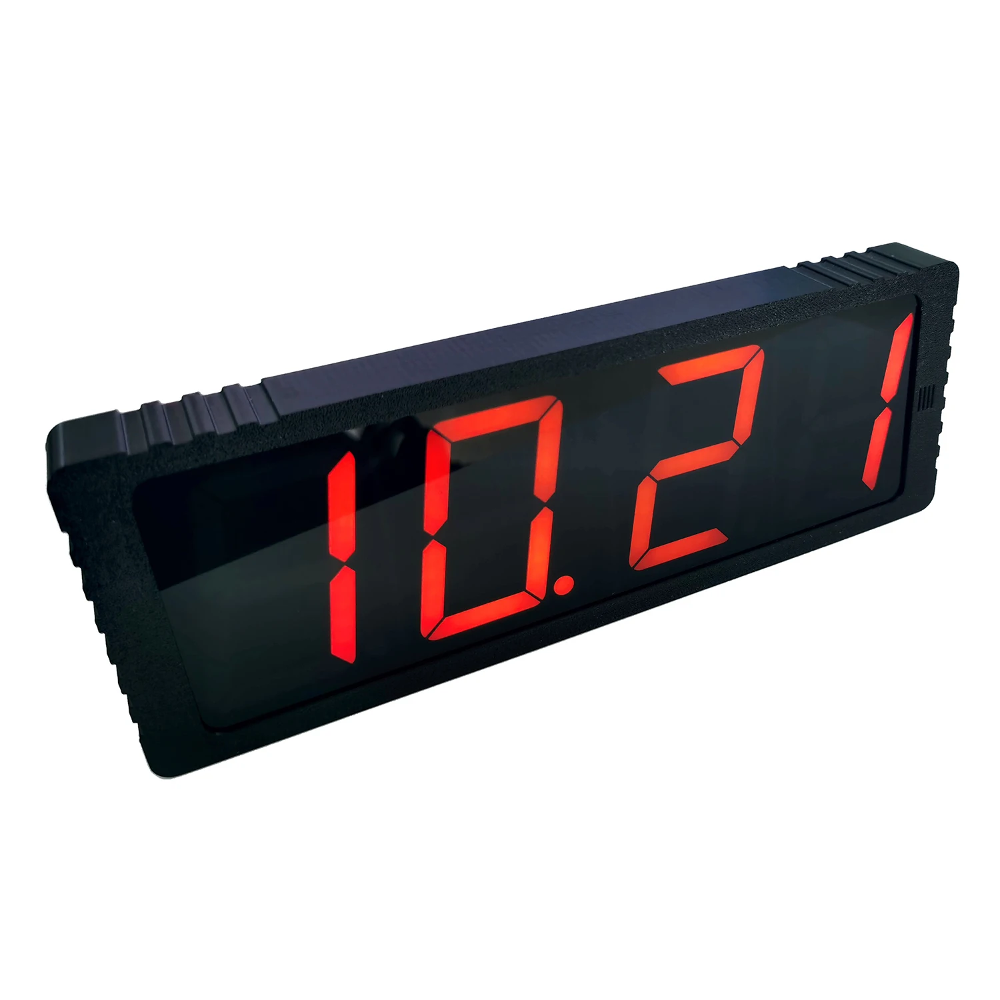

# MAS-8710 WiFi LCD Clock

Reverse-engineering and operational notes for an inexpensive WiFi LCD wall clock sold under several names. The casework studied here is labelled **MAS-8710**, but the WiFi/firmware stack is shared with a wider family of "DIY ESP8266 Networking Clock Kit" devices and Midea-style WiFi modules — see [Identification](#identification) below.

## Source

- Vendor listing (AliExpress): <https://he.aliexpress.com/item/1005008532153360.html>
- Product photo: <https://ae01.alicdn.com/kf/S131e0917d7e746729a2d5b4d81f9d6888.jpg>
- Closest matching English-language manual: ["DIY ESP8266 Networking Clock Kit Instruction Manual"](https://manuals.plus/ae/1005006339767938) — same firmware family, same captive-portal flow, same button semantics.

## Identification

The casework is unbranded ("MAS-8710" appears on the box but isn't a manufacturer mark). Indicators of the underlying stack:

| Signal | Observed |
|---|---|
| WiFi MAC OUIs | `d4:84:57`, `70:86:ce` (both registered to *GD Midea Air-Conditioning Equipment*), `60:01:94` (Espressif). All three are common ESP-based WiFi-module vendors. |
| DHCP hostname patterns | `MAS8710BN<MAC-tail>` (older firmware) and `ESP-<MAC-tail>` (newer firmware). Different units shipped with different firmware revisions. |
| Captive-portal SSID | `Config-XXXXXX` where `XXXXXX` is an opaque per-device identifier set at manufacture (does **not** consistently encode the MAC tail). |
| Captive-portal password | `33669999` (vendor default, identical across units). |
| Captive-portal gateway | `http://192.168.4.1`. |

## What it does

- 24-hour LCD with date and ambient temperature.
- WiFi-only configuration (no Bluetooth, no app).
- Time set automatically via NTP — server is configurable via the captive portal or LAN HTTP UI (firmware-dependent).
- 3 independent alarms (set via OSD only — see below).
- Manual + auto LCD brightness (set via OSD only).
- Timezone selectable by integer hour offset (-12..+12). DST is a global on/off flag with no schedule awareness.

## Configuration paths

| Method | Older firmware (`MAS8710BN-` hostname) | Newer firmware (`ESP-` hostname) |
|---|---|---|
| Captive-portal AP at `192.168.4.1` | ✓ | ✓ |
| LAN-side HTTP UI on TCP/80 | ✗ (port closed/filtered after WiFi join) | ✓ — full UI reachable, no auth |
| OSD via SET / UP buttons on the casework | ✓ | ✓ |

Two paths are documented in detail:

- **WiFi / NTP / timezone setup** — see [`docs/wifi-setup.md`](docs/wifi-setup.md)
- **HTTP API (newer firmware)** — see [`docs/http-api.md`](docs/http-api.md)
- **OSD button reference** — see [`docs/osd-buttons.md`](docs/osd-buttons.md)

## What is *not* exposed via HTTP

The web UI (whether via captive portal or LAN) only exposes WiFi credentials, NTP server, DST toggle, and integer timezone. It does **not** expose:

- LCD brightness (manual or auto)
- Alarm enable / disable / time
- Hourly chime / beep
- Temperature offset

These are OSD-only. The `setupSave` endpoint accepts arbitrary unknown query parameters and silently discards them — it returns "Setup Saved!" regardless — so response-based fuzzing yields no signal. Confirmed empirically against firmware versions on three different units.

## Drift behaviour

Out of the box, two units side-by-side **drift visibly relative to each other** even though both are WiFi-connected. Causes:

1. Firmware re-syncs only periodically (~hourly) and free-runs in between using the WiFi-SoC's onboard crystal, which is not high-stability.
2. Default NTP servers are public pools whose round-trip and stratum vary per unit and per region — two clocks may end up pinned to different upstreams with different skews.
3. The DST flag is global; if one unit has it set and the other doesn't, the visible offset is exactly an hour and the *appearance* of "drift" can be a misconfigured DST flag rather than crystal drift.

**Mitigation:** point all units at the same low-latency local NTP server. On a LAN with an OPNsense / pfSense / dnsmasq router that runs an NTP daemon, configure each clock with `NTP Server = <router-LAN-IP>`. This collapses the per-unit RTT skew to sub-millisecond and means all units share an identical reference cadence. Verified to bring two side-by-side units into visible second-level agreement.

## Repository scope

This repo is product-focused — what the device is, what it exposes, and how to drive it. Deployment-specific details (LAN inventory, per-unit assignments, chosen NTP server) are intentionally out of scope and live elsewhere.
